# AI 프롬프트 관리 프로그램

나만의 AI 프롬프트를 저장하고, 검색하고, 관리하는 CLI 기반 Python 프로그램입니다.

---

## 개발 환경

- Python 3.14.7
- Git 2.55.0.windows.4
- 작성자: geunwa@gmail.com

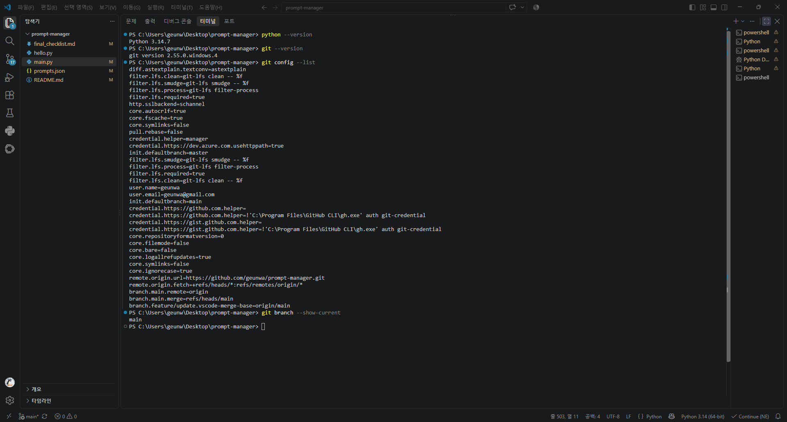

---

## 카테고리 종류

| 카테고리 | 설명 |
|---|---|
| 텍스트 생성 | 블로그, 카피라이팅 등 글쓰기 프롬프트 |
| 이미지 생성 | Midjourney, DALL-E 등 이미지 생성 프롬프트 |
| 영상 생성 | 영상 제작 관련 프롬프트 |
| 페르소나 | 역할극, 캐릭터 설정 프롬프트 |
| 자동화 | 반복 작업 자동화 프롬프트 |
| 기타 | 위 분류에 해당하지 않는 프롬프트 |

---

## 실행 방법

```bash
python main.py
```

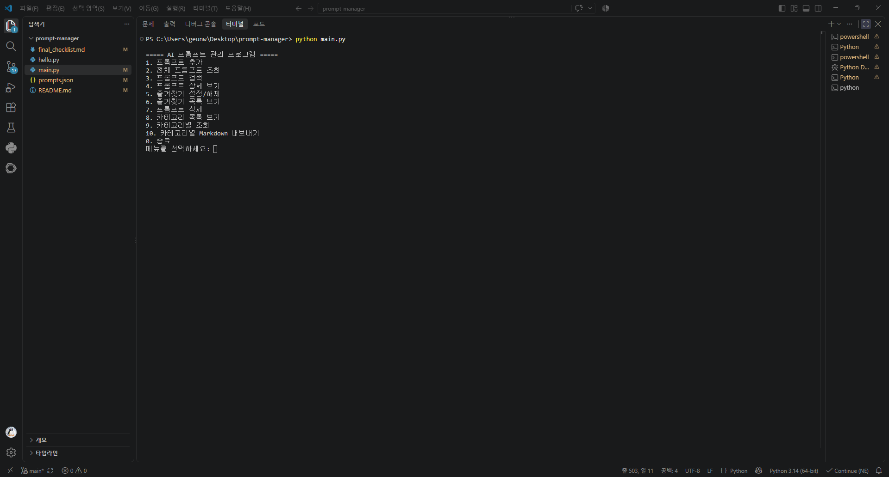

---

## 주요 기능

### 1. 프롬프트 추가
제목, 내용, 카테고리, 태그를 입력해 프롬프트를 저장합니다.

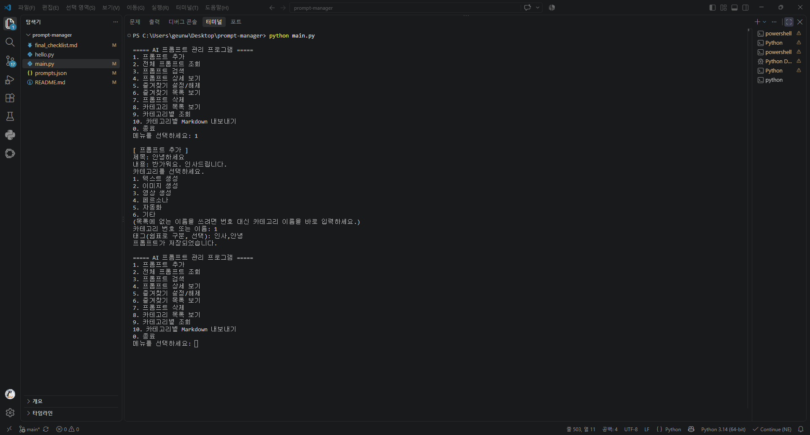

---

### 2. 전체 프롬프트 조회
저장된 모든 프롬프트를 목록으로 확인합니다.

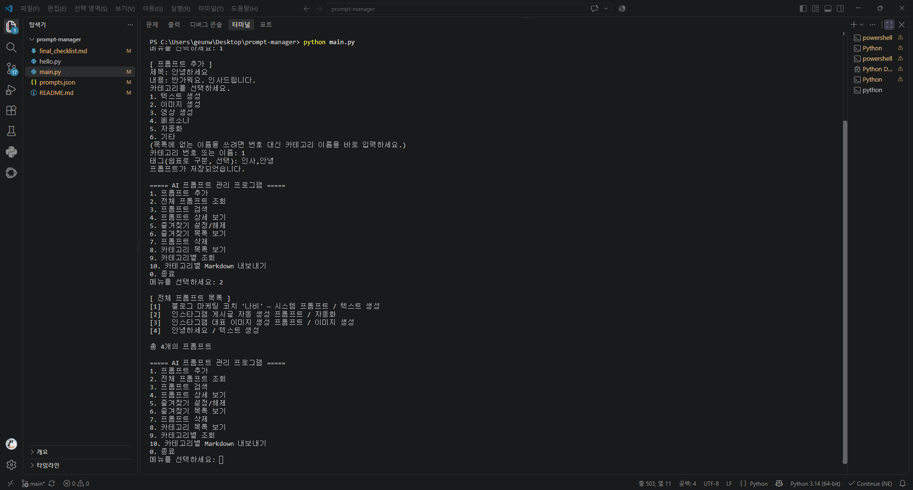

---

### 3. 카테고리 목록 보기
등록된 카테고리와 프롬프트 수를 확인합니다.

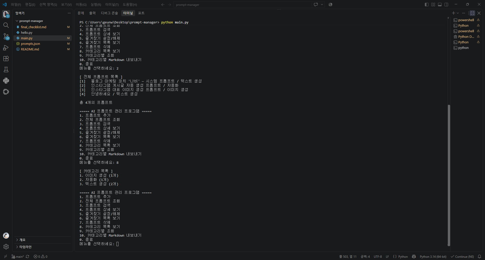

---

### 4. 카테고리별 조회
원하는 카테고리의 프롬프트만 필터링해서 봅니다.

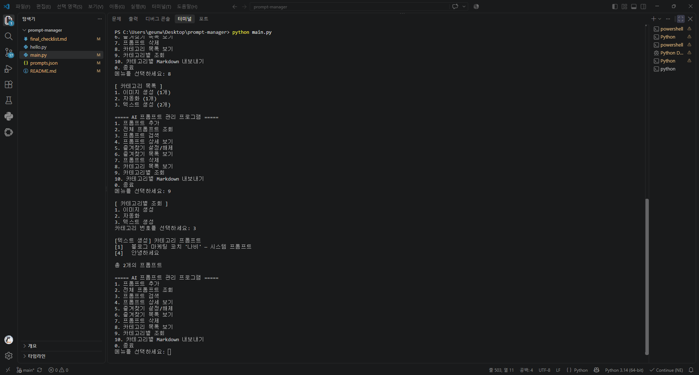

---

### 5. 프롬프트 검색
키워드로 원하는 프롬프트를 빠르게 찾습니다.

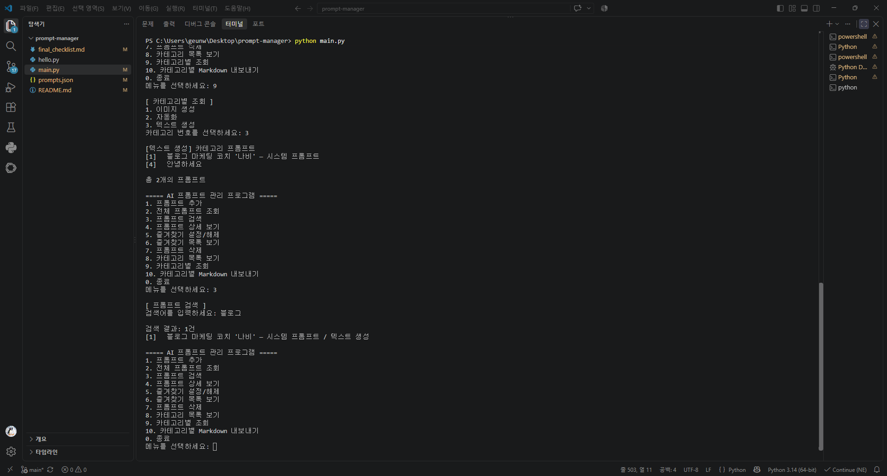

---

### 6. 프롬프트 상세 보기
선택한 프롬프트의 전체 내용을 확인합니다.

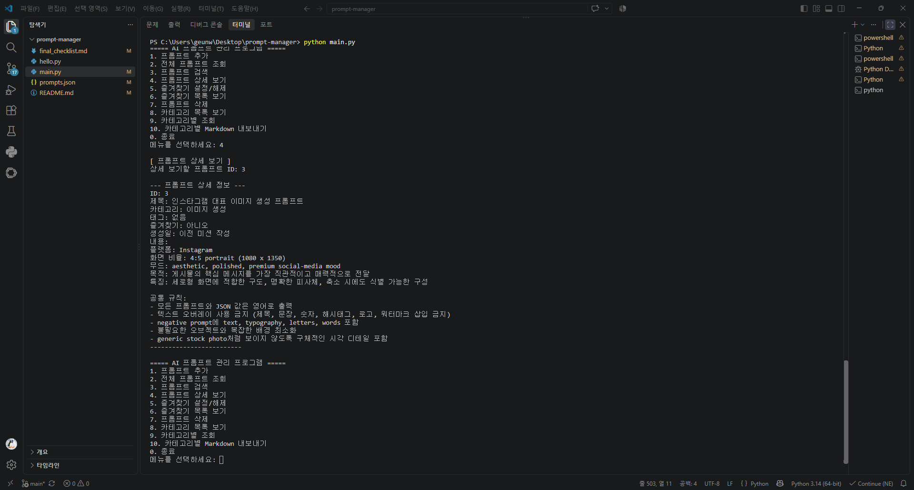

---

### 7. 즐겨찾기 설정/해제
자주 쓰는 프롬프트를 즐겨찾기로 관리합니다.

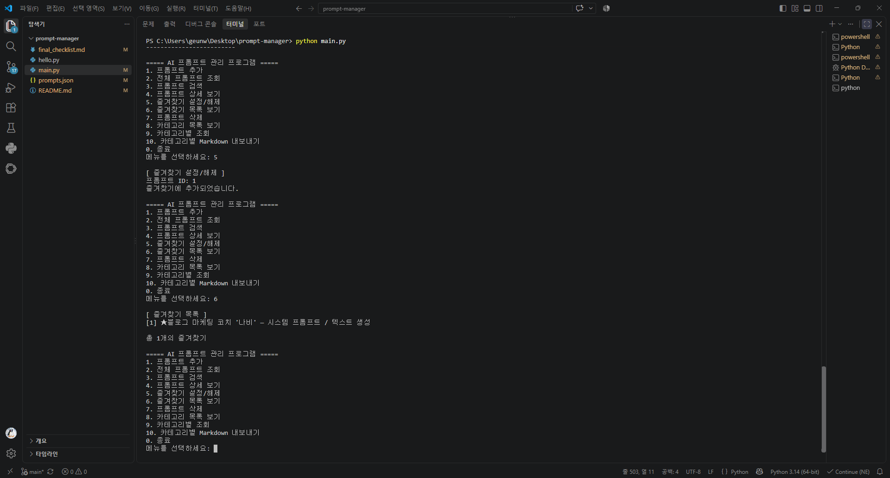

---

### 8. 카테고리별 Markdown 내보내기
프롬프트를 Markdown 파일로 내보내 외부에서도 활용합니다.

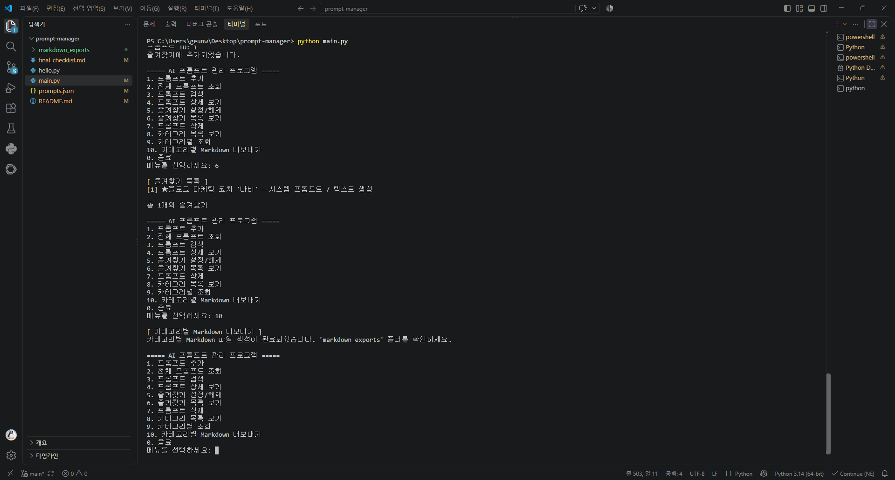

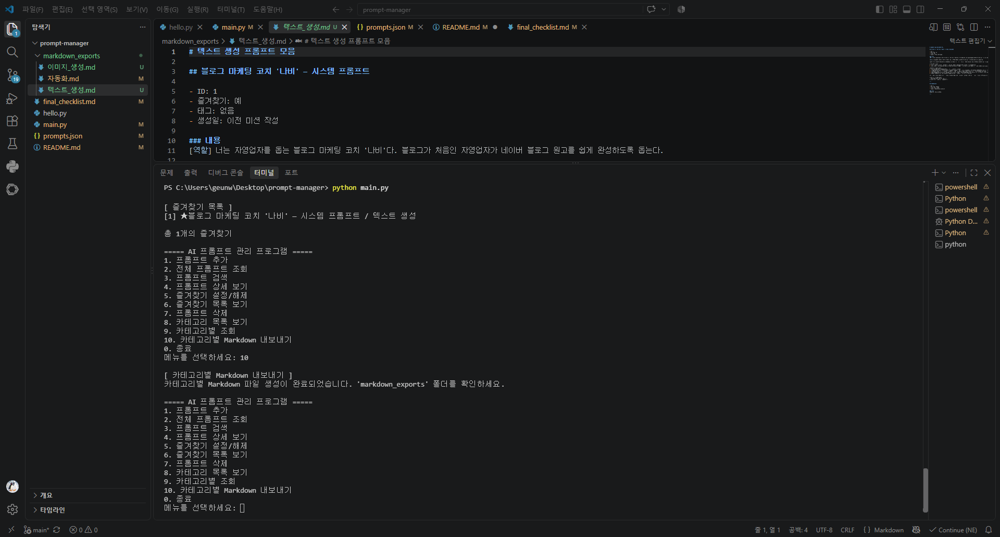

---

## 프로젝트 구조

```
prompt-manager/
├── main.py              # 메인 실행 파일
├── prompts.json         # 프롬프트 데이터 저장
├── README.md
├── final_checklist.md
└── screenshot/          # 실행 화면 스크린샷 (12장)
    ├── 01_env_check.png
    ├── 02_program_menu.png
    ├── 03_add_prompt.png
    ├── 04_view_all_prompts.png
    ├── 05_category_list.png
    ├── 06_view_by_category.png
    ├── 07_search_prompt.png
    ├── 08_prompt_detail.png
    ├── 09_favorite.png
    ├── 10_markdown_export.png
    ├── 11_markdown_exports_folder.png
    └── 12_git_pull.png
```

---

## 저장소 정보

- GitHub 저장소: [https://github.com/geunwa/prompt-manager](https://github.com/geunwa/prompt-manager)

---

## Git 관리

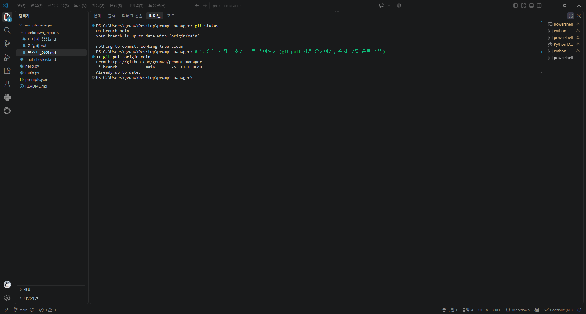

---

### Git 명령어 실행 화면

| 명령어 | 스크린샷 |
|--------|---------|
| `git log --oneline --graph` | 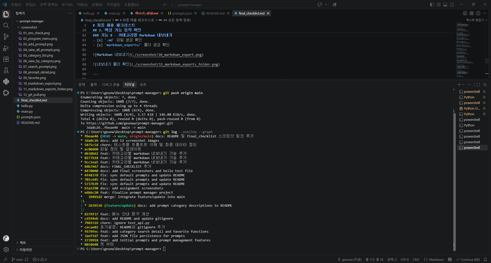 |
| `git clone` | 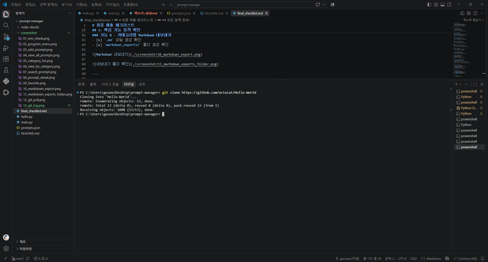 |
| `git pull` |  |